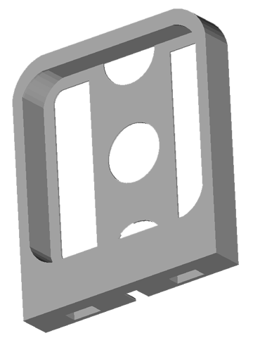

# samsung-wireless-charger-stand
A stand for your phone with space to mount a Samsung wireless charger

The stand is split into two pieces to make printing easier.

The base holds the phone and has a trench to fix the charger's usb cable:

And the back itself has space to mount the charger:

The printed result after joining the two pieces and mounting the charger and adding a small strip of foam rubber.

